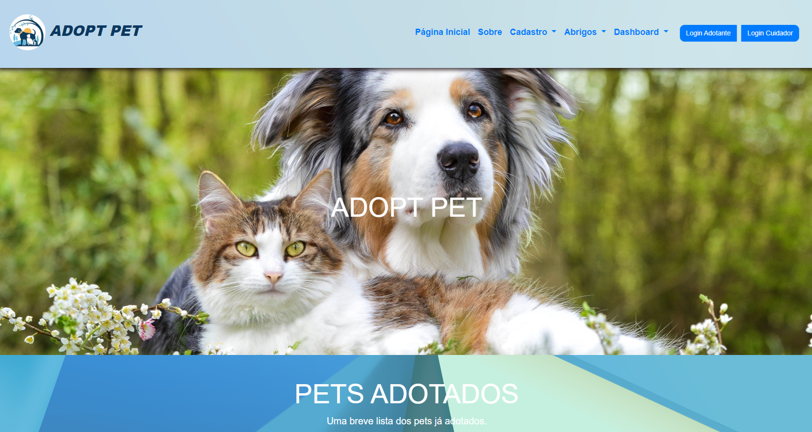
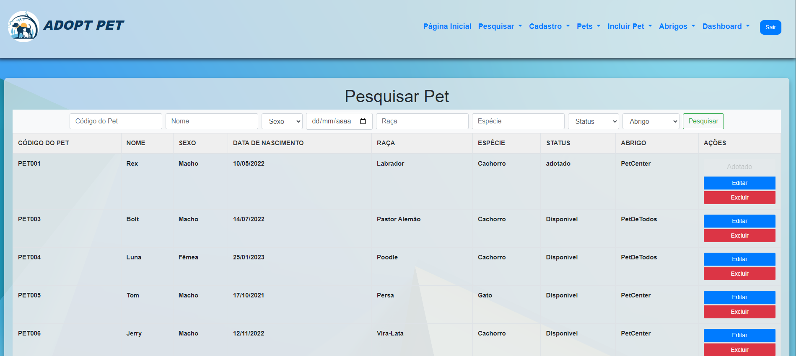
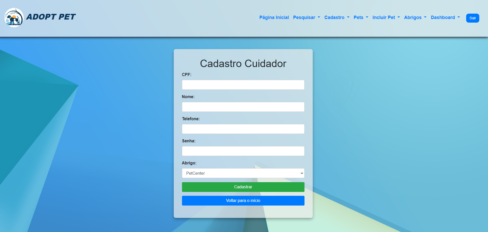

# 🐾 AdoptPet

## 📌 Resumo

O sistema **“AdoptPet”** consiste em uma aplicação web desenvolvida para facilitar o processo de adoção de animais domésticos. A plataforma conecta adotantes, cuidadores e abrigos em um único ambiente, permitindo o cadastro, gerenciamento e busca de pets disponíveis para adoção.

O objetivo principal é tornar a adoção mais prática, organizada e acessível por meio de uma interface intuitiva e responsiva.

---

## 1. 🎯 Tema

O trabalho final tem como tema o desenvolvimento de um sistema web para gerenciamento e adoção de animais domésticos, denominado **“AdoptPet”**.

---

## 2. 📦 Escopo

- Cadastro e autenticação de usuários  
- Cadastro e gerenciamento de pets  
- Visualização detalhada dos animais disponíveis  
- Busca e filtragem de pets  
- Solicitação de adoção 
- Controle do status de adoção dos animais  

---

## 3. 🚫 Restrições

- O sistema será desenvolvido apenas como aplicação web.
- O sistema dependerá de um servidor local ou hospedagem compatível com PHP e MySQL.

---
## 4. 🖼️ Protótipo
### Tela Inicial

### Pesquisa de Pets

### Cadastro de Cuidador

---

## 5. 📚 Referências

- https://www.petlove.com.br/
